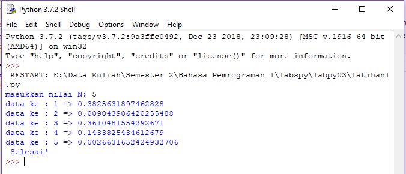
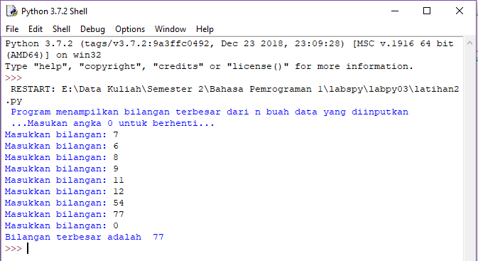
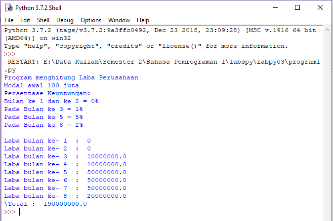

# Latihan1: Menentukan Nilai N dari bilangan yang

## Algoritma - Latihan1

* Masukkan Bilangan 
* Import Random data untuk bilangan yang diinput
* Menentukan hasil nilai random untuk data yang di input dalam range 0.0 s/d 0.5
* Tampilkan Nilai Bilangan acak yang diinput

## Contoh Hasil Program Setelah di run

# Latihan2: Menampilkan Bilangan terbesardari N bilangan, masukkan angka 0 untuk berhenti

## Algoritma - Latihan2

* Masukkan Bilangan
* Tampilkan Bilangan
* Stop proses saat bilangan 0 diinput
* Tentukan Bilangan terbesar (Max)
* Tampilkan Bilangan terbesar

## Contoh Hasil Program Setelah di run

# Program1: Perulangan - Menghitung Laba Perusahaan

## Algoritma - Program1

* Masukkan modal awal
* Tentukan range bulan persentase keuntungan yang akan diinput
* Jika Bulan ke 1 dan ke 2 tidak ada keuntungan maka kalikan modal dengan 0%
* Jika Bulan ke 3 dan ke 4 keuntungan 1% maka kalikan modal dengan 1%
* Jika Bulan ke 5 sampai ke 7 keuntungan 5% maka kalikan modal dengan 5%
* Jika Bulan ke 8 keuntungan 2% maka kalikan modal dengan 2%
* Tampilkan persentase keuntungan
* Jumlahkan total keuntungan
* Tampilkan total keuntungan

## Contoh Hasil Program Setelah di run

